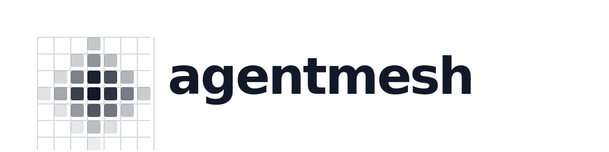

# agentmesh

<p align="center">
  
</p>

<p align="center"><strong>One mesh for less cost, better context, and smaller changes.</strong></p>

<p align="center">
  
</p>

The cost view is intentionally live: run `/mesh-cost` in Copilot CLI to
populate the floor, stack tax, and marginal cost per MCP server. The README
does not claim fixed savings or fabricate benchmark numbers.

agentmesh is a single integration layer for agent tools. It installs and wires
the stack, keeps each host consistent, exposes operating modes, and shows what is connected.

## What it orchestrates

| Tool | Role |
|---|---|
| **CodeGraph** | Structural code search |
| **AX** | Evidence graph and workflow triage |
| **Engram** | Persistent local memory |
| **Serena** | LSP navigation and symbol editing |
| **RTK** | Command-output token compression |
| **Ponytail** | Required minimal-code policy on Claude Code and Copilot CLI |
| **Mesh mode** | Cost-aware scope, implementation, and response rules |

The manifest is the extension point: add another tool there when it has a
clear role, install path, and host registration shape.

## Default CodeGraph/Serena routing

Every Agentmesh install receives this preset:

| Need | Use |
|---|---|
| Architecture, relevant files/symbols, call paths, callers/callees, or edit impact | **CodeGraph first** |
| Exact LSP symbol resolution, references/implementations, rename, or symbol-level edit | **Serena second** |
| CodeGraph has no usable index, is stale, or lacks the detail | **Serena read fallback** |

Do not ask both tools the same discovery question. CodeGraph narrows the
repository context; Serena performs the precise symbol operation. CodeGraph
indexing remains opt-in, so Serena is the safe fallback on a newly installed
machine until an index exists.

## Install

```bash
bash setup/install.sh
```

Use `--check` to inspect the machine without installing:

```bash
bash setup/install.sh --check
```

`stack.lock.json` records the tested Agentmesh/tool versions. The check reports
missing or drifted binaries and never replaces a newer tool automatically.
For safety, remote bootstrap scripts for `uv` and AX are disabled by default;
install them yourself or explicitly opt in with
`AGENTMESH_ALLOW_REMOTE_INSTALL=1`.

On Claude Code and Copilot CLI, the installer also installs the official,
separate Ponytail plugin (`ponytail@ponytail`) when it is missing. Agentmesh
does not ship Ponytail commands or skills, so the two plugins cannot collide.
For VS Code, the installer writes a managed global instruction file at
`~/.copilot/instructions/agentmesh.instructions.md`, using VS Code's supported
user-profile instruction tier by default. It applies the Mesh policy across workspaces;
VS Code still has no native Ponytail commands or hooks.
Run the same installer after upgrading Agentmesh to refresh that managed file.

Fast repository checks use `prek`:

```bash
prek install
prek run --all-files
npm run check
```

Renovate keeps GitHub Actions and npm dependencies current. Ruff, Xenon, and
Just are intentionally not installed here: this repository has no Python and
already has native npm commands.

Run the clean Linux validation in Docker:

```bash
bash tests/docker-install.sh
```

The installer configures every detected host in one run:

- **Claude Code** — native plugin, hooks, and MCP registration.
- **Copilot CLI** — native plugin, hooks, and MCP registration.
- **VS Code Copilot Chat** — native `mcp.json` registration plus repository
  and global Agentmesh instructions. VS Code has no third-party plugin
  marketplace, so the installer cannot activate Ponytail or Mesh hooks.

It runs on macOS and Linux, and from Git Bash or WSL on Windows. AX currently
skips on Linux and Windows because its available release is macOS-only.

The underlying CLIs are installed globally where their package manager supports
it (`brew`, `npm -g`, or `uv tool`). CodeGraph is opt-in per repository: the
installer asks whether to initialize and index every Git repository you open.
On Claude Code and Copilot CLI, the hook does this at session start. VS Code
uses CodeGraph's native workspace/MCP flow and its instruction tier. Answer no
to keep indexing manual; enable it later with
`AGENTMESH_CODEGRAPH_GLOBAL=1 bash setup/install.sh`.

## Mesh modes

```text
/mesh lite
/mesh full
/mesh ultra
/mesh off
/mesh
```

- **lite** — complete the request and mention one simpler alternative.
- **full** — inspect the real flow and ship the smallest safe change.
- **ultra** — challenge speculative scope and optimize aggressively for cost,
  clarity, and minimal code without weakening security or correctness.
- **off** — disable the behavior layer for the current session.

Persist the default for new sessions with `/mesh default full`.

## Commands

| Command | Purpose |
|---|---|
| `/mesh [mode]` | Set or report the active mode |
| `/mesh-status` | Show connected tools and active mode |
| `/mesh-cost` | Measure marginal tool cost |
| `/mesh-evaluate` | Judge tools and skills by value, cost, and redundancy |

## Uninstall

```bash
node scripts/uninstall.js
```

Then remove the plugin from the host:

```text
Claude Code: /plugin remove agentmesh
Copilot CLI: copilot plugin remove agentmesh
```

Agentmesh deliberately leaves Ponytail installed because it may also be used
independently. To roll back its companion-plugin installation:

```text
Claude Code: claude plugin remove ponytail@ponytail
Copilot CLI: copilot plugin uninstall ponytail@ponytail
```

## Details

See [`docs/agentmesh.md`](docs/agentmesh.md) for architecture, installation
behavior, and sandbox verification.
See [`CHANGELOG.md`](CHANGELOG.md) for release history.

## License

MIT — see [`LICENSE`](LICENSE).
