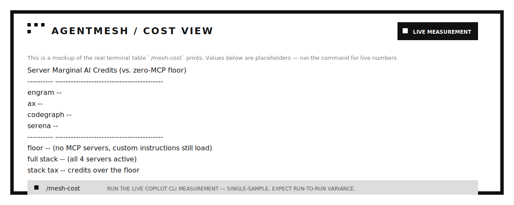

# agentmesh — orchestrating the agent-tool stack

agentmesh wires up the agent-tool stack as one installable integration, keeps
host configuration consistent, exposes cost-aware operating modes, and reports
what is connected.

## Install

**One command does everything**: installs the 5 underlying binaries
(`engram`, `ax`, `codegraph`, `serena`, `rtk`) via whichever package manager
each uses, installs the required Ponytail companion plugin on Claude
Code/Copilot CLI, installs agentmesh itself into detected native plugin hosts,
and registers the 4 MCP servers right away (doesn't wait for the self-healing
hook — see below):

```bash
bash setup/install.sh
```

Want to see what's missing first without installing anything? `bash
setup/install.sh --check`.

`stack.lock.json` is the compatibility contract for the tested Agentmesh
release, its five external tools, and Ponytail. The installer reports missing
or different versions but does not silently downgrade an existing installation.
The reproducible Linux smoke test is:

```bash
bash tests/docker-install.sh
```

Repository quality gates are intentionally small: `prek.toml` uses prek's
native fast hooks plus the local JavaScript/shell syntax check, while Renovate
tracks GitHub Actions and npm dependencies. Ruff, Xenon, and Just are omitted
because this repository has no Python and npm scripts already cover its CLI
commands.

The underlying CLIs are installed globally where their package manager supports
it (`brew`, `npm -g`, or `uv tool`). The installer asks separately whether
CodeGraph should initialize and index every Git repository opened on the
machine. On Claude Code and Copilot CLI, the hook does this at session start;
VS Code uses CodeGraph's native workspace/MCP flow and instruction tier. That
opt-in creates a `.codegraph/` index per repository; set
`AGENTMESH_CODEGRAPH_GLOBAL=1` for a non-interactive install.

**VS Code Copilot Chat** has no plugin mechanism, so the installer registers
its MCP servers directly into the native `mcp.json` and writes its managed
global policy file to `~/.copilot/instructions/agentmesh.instructions.md`.
That is VS Code's supported user-profile instruction tier by default. If VS Code is
installed alongside Claude Code or Copilot CLI, it is configured in the same
run rather than being treated as an exclusive fallback.

**Verify**: run `/mesh-status` in the client — it reports, live, which of
the 4 MCP servers actually connected, plus RTK's hook and agentmesh's mode.

## Self-healing: what's actually automatic and what isn't

Being precise about this, since it's easy to overclaim:

- **Fully automatic, no step required**: agentmesh's mode layer and RTK's hook —
  both are bundled directly into the plugin, active the moment it's
  installed.
- **Required on native plugin hosts**: Ponytail is installed from its official
  marketplace when missing on Claude Code or Copilot CLI. It remains a
  separate plugin, so Agentmesh does not duplicate its commands or skills.
- **Instant if you used `setup/install.sh`, self-healing otherwise**: the 4
  MCP servers get registered immediately as the last step of
  `setup/install.sh`. If you instead installed the plugin some other way
  (marketplace install without running the script, a binary installed after
  the plugin, config drift), `hooks/mesh-status-hook.js` catches the gap on
  the next `SessionStart` and spawns `setup/register-mcp.js` in the
  background automatically (Claude Code and Copilot CLI only — see the VS
  Code note above). There's no "postinstall" hook in either client's plugin
  system (checked both CLIs' `--help` directly) — `SessionStart` is the
  earliest real hook point, so that's what triggers the fallback.
- **Explicit, not silent**: installing the 5 underlying binaries (`engram`,
  `ax`, `codegraph`, `serena`, `rtk`) themselves. `bash setup/install.sh`
  *does* install them now (via `brew`/`npm`/`uv`, whichever each tool uses) —
  but only when you run that command yourself. `bash setup/install.sh
  --check` reports without installing anything, if you want to see the gap
  first. No *hook* in this repo ever calls an installer on its own; typing
  the install command is the consent, same principle as any other
  `install.sh` you'd run from a project's README.

## What's new

1. **Orchestrated MCP stack** — CodeGraph, AX, Engram, and Serena, registered
   consistently across Copilot CLI, VS Code, and Claude Code from one file:
   `manifest.json`.
2. **`setup/register-mcp.js`** — idempotent registration script. Reads
   `manifest.json`, resolves each server's binary with the host's native
   executable lookup, and applies it:
   - Copilot CLI: direct JSON merge into `~/.copilot/mcp-config.json`.
   - VS Code: direct JSON merge into `mcp.json`, preserving every unrelated
     server already there.
   - Claude Code: shells out to the supported `claude mcp add`/`remove` CLI
     (remove-then-add, so it's idempotent without parsing command output).
   - Serena's `excluded_tools` (its 6 memory tools, which duplicate Engram)
     get written to `~/.serena/serena_config.yml`, since that's a global
     Serena setting, not a per-client registration.
3. **`setup/install.sh`** — the one-command installer: installs the 5
   underlying binaries (brew on macOS; brew if present on Linux, otherwise a
   direct, version-locked and lock-checksum-verified GitHub-release binary
   downloads for `engram`/`rtk`; pinned npm for `codegraph`; and pinned `uv` for
   `serena`. Installing `uv` or AX from a remote installer requires the
   explicit `AGENTMESH_ALLOW_REMOTE_INSTALL=1` opt-in. It installs Ponytail
   from `DietrichGebert/ponytail` when missing on native plugin hosts, then
   installs agentmesh itself and registers the 4 MCP servers.
   `--check` reports what's present/missing without installing anything, for
   anyone who wants to see the gap before running it for real.
4. **`/mesh-cost`** — runs `dashboard/cost-report.js`, which re-measures the
   live, marginal AI-credit cost of each MCP server in Copilot CLI by
   toggling `--disable-mcp-server` per server. Never invents a number; if the
   script errors, it reports the error.
5. **`/mesh-status`** — live check of which of the 4 servers are actually
   connected in the current session (not just configured), plus RTK's hook
   status and agentmesh's current mode.
6. **`/mesh-evaluate`** — evaluates every connected tool, hook, and skill for
   concrete value, measured cost, redundancy, and failure risk; it recommends
   what to keep, limit by mode, or remove.
7. **Self-healing SessionStart hook** (`hooks/mesh-status-hook.js`) — checks
   whether the 4 MCP servers are present in this client's config, and if
   not, **kicks off `setup/register-mcp.js` in the background automatically**
   (fire-and-forget, since Claude Code's registration path can take longer
   than a hook's timeout allows). Runs alongside (not instead of)
   `mesh-activate.js`. Stays silent when everything's configured; a
   5-minute marker file avoids re-triggering every session start while a fix
   is already in flight. Opt out with `AGENTMESH_NO_AUTO_REGISTER=1` if you'd
   rather run it by hand. This only wires up config for binaries that are
   *already installed* — it never installs software on its own (see Install
   step 1).
8. **RTK hook wiring** — RTK ships its own native hook processors
   (`rtk hook claude`, `rtk hook copilot`) that do the actual command
   rewriting. `hooks/rtk-rewrite.js` is a thin node wrapper around them
   (required only so the hook's `command` field stays `node <script>` —
   shell-agnostic, per `hooks-windows.test.js`), bundled into
   `hooks/claude-hooks.json` and `hooks/copilot-hooks.json`. No
   rewriting logic duplicated — RTK already does that; this just activates
   it as part of installing the plugin instead of a separate manual
   hook-file edit, and degrades silently if `rtk` isn't on `PATH`.

## Servers, hooks, companion plugin, and bundled behavior

The stack does not plug in through a single mechanism:

- **`servers`** (CodeGraph, AX, Engram, Serena) — separate MCP processes.
  Need per-client config registration; that's what `setup/register-mcp.js`
  does.
- **`hooks`** (RTK) — not an MCP server. Wired as a `PreToolUse` hook bundled
  directly into this plugin's `hooks/*.json`; installing the plugin is enough,
  nothing for `register-mcp.js` to do.
- **Required companion plugin** (Ponytail) — installed separately from its
  official marketplace on Claude Code and Copilot CLI. This preserves its
  dedicated public namespace and avoids duplicate command/skill injection.
- **`builtin`** (agentmesh mode) — the synchronized stack conductor. Ships as
  this plugin's own `skills/`/`commands/`; one `/mesh <level>` drives Ponytail's
  level and RTK's compression and sets discovery/verbosity. Nothing external to
  register or install at all.

## What this is NOT (read before you assume more than it does)

Agentmesh registers 4 independent MCP servers into your clients' config and
reports on them — it does not merge their functionality into a single
process. Each of CodeGraph/AX/Engram/Serena keeps running as its own separate
program; agentmesh is the thing that tells your 3 clients about all 4 at
once, and tells you whether it worked. If you want a true single-process
aggregator (one MCP endpoint that internally routes to all 4 backends), that
is a materially different, bigger piece of software this repo does not
currently include.

## Why CodeGraph/AX/Engram/RTK/Serena/Ponytail aren't forked in

The mesh mode layer is built into agentmesh. The other tools are separate
projects that already work and update themselves:

- CodeGraph, AX, Engram, Serena are independent MCP servers — forking them
  would mean maintaining divergent copies instead of just registering them.
- RTK is a separate CLI with its own hook processors already built in —
  forking it would mean re-implementing command-rewriting logic RTK already
  ships.
- Ponytail is a separate policy plugin; copying it into Agentmesh would
  duplicate its public commands and skills in the same client.

Agentmesh orchestrates the stack without absorbing its source.

## VS Code Copilot Chat

VS Code's native Copilot Chat has no plugin/marketplace mechanism — it only
loads MCP servers via `mcp.json` and instruction files, so it is covered at
the registration/instruction tier only. `register-mcp.js --client=vscode`
covers the MCP-registration half, and `setup/install-vscode-instructions.js`
writes the global Agentmesh policy into VS Code's documented user instruction
directory. VS Code cannot load Ponytail's native plugin commands or hooks
until it adds a plugin mechanism.

## Measured, not promised

The README includes a monochrome cost view to make the value of measurement
visible without turning an illustration into a fake benchmark:



The token/credit numbers this repo produces come from
`dashboard/cost-report.js`, run for real, against the real Copilot CLI, from
inside this session's development. See the script's own header comment for
the caveats (it measures a warmed-up marginal cost, not a cold-start one; a
few credits of run-to-run variance is normal — GitHub's backend caches
something across back-to-back calls that isn't fully under this script's
control).

## Sandbox-tested, not just reasoned about

`setup/install.sh`'s real install path was run inside an isolated Docker
container (fresh Ubuntu, no prior Homebrew/Copilot CLI/anything) with fake
`claude`/`copilot` stub binaries standing in for the real CLIs, to see the
whole flow end to end without touching any real machine. That from-scratch
run caught 3 real bugs no amount of testing on an already-set-up machine
would have surfaced:

1. **`register-mcp.js`'s `applyCopilot()` crashed with `ENOENT`** on a
   machine where `~/.copilot/` had never been created — it checked
   `fs.existsSync` before reading but never created the directory before
   writing. Fixed (`fs.mkdirSync(..., { recursive: true })` before the
   write) and covered by `tests/register-mcp.test.js`, which reproduces the
   exact from-scratch-HOME scenario.
2. **`engram` and `rtk` assumed Homebrew on Linux**, which isn't the native
   package manager there. Both actually publish real Linux binaries on
   GitHub releases — `setup/install.sh` now downloads those pinned assets
   directly and verifies their lock-file SHA-256 checksums when `brew` isn't
   present on Linux.
3. **`serena` silently required `uv` to already be installed** as a separate
   manual step. The installer can bootstrap `uv` only with the explicit
   `AGENTMESH_ALLOW_REMOTE_INSTALL=1` opt-in, before installing pinned Serena.

`ax` still correctly skips on Linux (genuinely macOS-only, not a bug), and
`codegraph` (npm-based) worked on the first try since npm is cross-platform
already. Re-run after the fixes: all 4 installable-on-Linux tools installed
for real, both fake CLIs got the plugin-install and MCP-registration calls,
and the resulting `~/.copilot/mcp-config.json` had all 3 resolvable servers
correctly wired to their real `~/.local/bin` paths.

**VS Code path, separately verified**: the first sandbox run only had
`claude`/`copilot` stubs on `PATH`, so `install.sh`'s VS-Code-only branch
(triggered when neither CLI is present but `code` is) never actually ran. A
second from-scratch container with only a fake `code` stub confirmed it
does: install.sh correctly detected VS-Code-only mode, skipped the
plugin-install step entirely (no plugin mechanism there), and
`register-mcp.js --client=vscode` wrote a correct `mcp.json` to
`~/.config/Code/User/`.

**Then verified against the real thing, not a stub**: a fake `code` binary
only proves `install.sh`'s own detection logic, not that VS Code itself
would accept the file. A third container installed the actual Microsoft VS
Code CLI (`apt install code` from `packages.microsoft.com`, the official
repo) and used it directly, as a non-root user (VS Code refuses to run as
root without extra flags):

- `code --add-mcp '{...}'` with no prior VS Code state wrote to
  `~/.config/Code/User/mcp.json` — the exact path this repo assumes,
  confirmed by VS Code's own official CLI, not inferred from convention.
- Ran `register-mcp.js --client=vscode` for real (fake tool binaries on
  `PATH`, only the JSON-writing logic under test), producing a 4-server
  `mcp.json` with `"type": "stdio"` on each entry.
- Then ran the real `code --add-mcp` again to add a 5th, unrelated server.
  VS Code's own CLI read this repo's file, left all 4 existing entries
  byte-for-byte unchanged, and merged its own entry in alongside them —
  genuine round-trip interoperability with the real product, not just "the
  JSON looks plausible."
